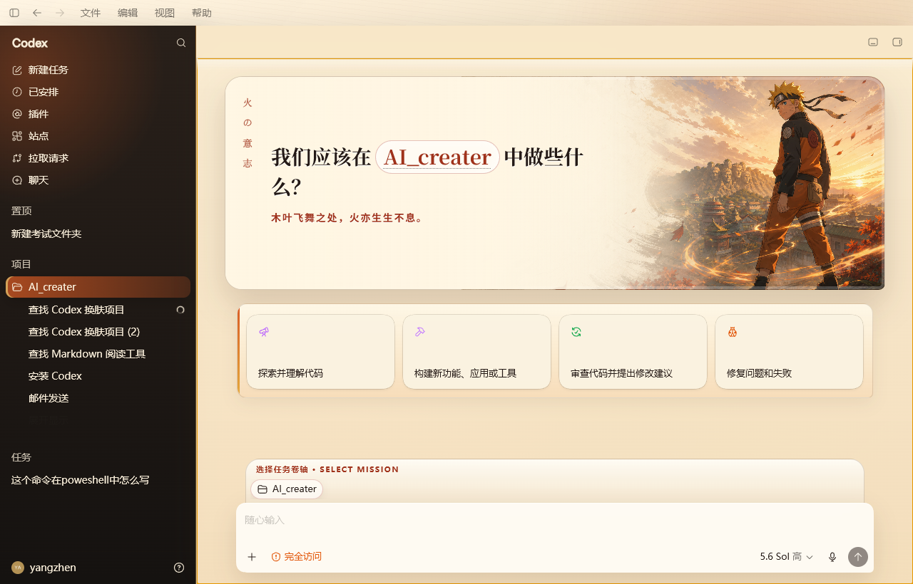

# Naruto: Will of Fire — Codex Windows 主题

一个可以直接安装到 Windows 版 Codex 桌面端的火影忍者风格 CodeDrobe 主题。它包含主题源码、自动打包、Windows Store/MSIX 启动兼容、持续 watcher、验证截图、一键恢复脚本，以及可恢复的 DeepSeek 任务栏图标和标题外观层。



本项目的主题工作流和 Windows helper 来自 [qcrao/codedrobe-one-shot-theme-skill](https://github.com/qcrao/codedrobe-one-shot-theme-skill)，运行时使用公开发布的 [`@codedrobe/core`](https://github.com/CodeDrobe/core)。相关代码遵循 Apache-2.0 许可证。

## 最快安装

环境要求：

- Windows 10/11；
- Microsoft Store 版 Codex 桌面端；
- [Node.js](https://nodejs.org/) 22.4 或更高版本（标准安装包自带 npm）；
- 可以访问 npm 和 GitHub。

安装步骤：

1. 下载本仓库 ZIP 并解压，或使用 `git clone`。
2. 直接运行即可；项目本地兼容补丁会忽略 Codex 的头像/宠物悬浮窗和分离式辅助窗口。
3. 在 Windows 文件资源管理器中双击 **`Apply Naruto Theme.cmd`**。不要从会自动回收子进程的任务终端启动，否则主题会应用成功，但后台 watcher 可能被终端一并结束。
4. 首次运行会自动执行 `npm install`，随后打包主题。Codex 可能自动关闭并重新启动一次。
5. 保持命令窗口开启，看到 `Installed and verified` 后即安装完成；默认还会把 Codex 的任务栏图标和窗口标题显示为 DeepSeek。

脚本不会修改 WindowsApps 中的应用文件。主题由 `@codedrobe/core` 注入，并由一个后台 watcher 在切换“新任务”和普通任务时重新应用。

### 新版 Codex：隔离 CDP 配置模式

如果普通入口提示 Codex 没有开放 `9335`，请改为双击
**`Apply Naruto Theme (Isolated CDP Profile).cmd`**。这个入口会在
`%LOCALAPPDATA%\CodeDrobe\Profiles\Codex-Naruto` 创建独立的 Codex 配置，
并同时传入 `--remote-debugging-port=9335` 与非默认 `--user-data-dir`。

独立配置不会复制正常 Codex 配置中的 Cookie、凭据或本地状态，因此第一次启动时
可能需要重新登录。以后继续使用这个入口即可加载主题；普通 Codex 快捷方式仍使用
原来的正常配置。Codex 设置里的“Enable full CDP access”用于 Chrome 和内置浏览器
会话，不等同于向 CodeDrobe 开放 Codex 应用界面的端口。

为兼容新版 Codex，`npm install` 会对**项目本地** `node_modules/@codedrobe/core` 应用一个可审计的小补丁：排除 `avatar-overlay` 与 `detached-window` 辅助页面，识别新版输入框，并避开隐藏的旧 `<main>`、选择真正可见的工作区。补丁源码见 `scripts/Patch-CodeDrobeCore.ps1`；它不会修改全局 Core、已安装 Skill 或 Codex 本体。该兼容规则已在 Windows Codex `26.908.4834.0` 上通过 DOM 预检。

## DeepSeek 任务栏图标和标题

这是一层独立、可恢复的 Windows 窗口外观定制，不修改 `WindowsApps`、Codex 可执行文件、Appx 清单或注册表。助手只处理当前 `OpenAI.Codex` 安装目录中拥有任务栏入口的可见顶层窗口，并保存原始标题和图标用于恢复。

- 单独启用：双击 **`Set DeepSeek Taskbar Icon.cmd`**，或运行 `npm run icon:set`。
- 单独恢复：双击 **`Restore ChatGPT Taskbar Icon.cmd`**，或运行 `npm run icon:restore`。
- 自定义任务栏文字：运行 `powershell.exe -NoProfile -ExecutionPolicy Bypass -File .\scripts\Start-DeepSeekTaskbarIcon.ps1 -WindowTitle "自定义文字"`。
- 安装主题但不启用任务栏定制：运行 `Apply Naruto Theme.cmd -SkipDeepSeekTaskbarIcon`。
- 使用其他 CDP 端口：运行 `Apply Naruto Theme.cmd -Port 9345`。

后台 watcher 会在 Codex 创建新窗口或普通重启后重新应用。Codex Appx 更新会改变安装目录，更新后需要再次运行启用脚本。详细设计和恢复流程见 [TASKBAR-ICON.md](TASKBAR-ICON.md)。

## 恢复 Codex 默认外观

双击 **`Restore Codex Default.cmd`**。脚本会先恢复 ChatGPT/Codex 原始标题和图标，再停止本项目拥有的主题 watcher，并调用 CodeDrobe 的 `restore` 恢复注入前的 Codex 外观设置。如果窗口颜色或图标仍被系统缓存，再正常重启一次 Codex。

## 安装 one-shot theme Skill（可选）

应用本仓库中的现成主题不要求安装 Skill。如果你希望在 Codex 中通过一句自然语言生成其他 CodeDrobe 主题，可双击 `Install CodeDrobe Skill.cmd`。

它会从 [qcrao/codedrobe-one-shot-theme-skill](https://github.com/qcrao/codedrobe-one-shot-theme-skill) 下载 `skills/codedrobe-one-shot-theme` 到：

```text
%USERPROFILE%\.codex\skills\codedrobe-one-shot-theme
```

安装完成后重启 Codex。之后可以让 Codex创建新的主题，例如：“用 CodeDrobe 创建并直接安装一个水墨山水主题”。

## 自己定制主题

1. 用自己的宽幅图片替换 `theme/assets/hero.png`。建议至少 2000px 宽，主体放在右侧，左侧留出文字空间。
2. 编辑 `theme/theme.json` 中的 `id`、`displayName`、`version`、首页文案和 `baseTheme` 配色。
3. 编辑 `theme/codex.css` 调整首页英雄图、侧边栏、建议卡片、输入框和对话水印。
4. 双击 `Build Theme.cmd` 只打包，或双击 `Apply Naruto Theme.cmd` 打包并安装。

生成的主题包位于 `dist\naruto-shinobi.codedrobe-theme`。如果修改了主题 ID，请同步修改三个 PowerShell 脚本中的包名或 watcher 状态名。

## 命令行用法

```powershell
npm install
npm run build
npm run apply
npm run restore
npm run icon:set
npm run icon:restore
```

## 项目结构

```text
theme/                         主题清单、CSS 与本地图片
scripts/                       打包、安装、验证、恢复与 MSIX 启动脚本
tools/DeepSeekTaskbarIcon/     可审计的 Win32 任务栏外观 watcher 源码
assets/deepseek/               DeepSeek 多尺寸任务栏图标及来源说明
bin/codedrobe.cmd              调用项目固定版本的公开 CodeDrobe Core
Apply Naruto Theme.cmd         一键安装/重新应用
Apply Naruto Theme (Isolated CDP Profile).cmd  新版 Chromium 隔离配置入口
Build Theme.cmd                只构建 .codedrobe-theme
Restore Codex Default.cmd      停止 watcher 并恢复默认外观
Set DeepSeek Taskbar Icon.cmd  单独启用 DeepSeek 图标和标题
Restore ChatGPT Taskbar Icon.cmd  单独恢复原始图标和标题
Install CodeDrobe Skill.cmd    可选：安装上游 one-shot theme Skill
```

## 已知限制

- CodeDrobe 0.3.0 的 Windows 支持仍属于 beta。
- 本项目固定使用并修补 Core 0.3.0；升级 Core 时补丁会在源码不匹配时主动停止，而不会盲目修改。
- 完全退出 Codex、重启 Windows 或 watcher 被终止后，需要再次运行 `Apply Naruto Theme.cmd`。
- Codex Appx 更新后需要重新运行任务栏图标启用脚本，以匹配新的安装目录。
- 如果图标 watcher 被强制终止而来不及恢复，完全关闭并重新打开 Codex 即可恢复 Appx 自带标题和图标。
- Codex 更新后 DOM 结构可能变化；脚本会先做预检，失败时不会强行注入。
- `theme/assets/hero.png` 是非官方同人视觉，建议仅供个人、非商业使用，详见 [ASSET-NOTICE.md](ASSET-NOTICE.md)。
- DeepSeek favicon 不属于本项目的 Apache-2.0 授权范围，仅用于用户主动启用的本机外观定制，详见 [ASSET-NOTICE.md](ASSET-NOTICE.md)。

## 安全说明

- 调试端口只绑定到 `127.0.0.1:9335`；
- 不修改、替换或获取 WindowsApps 文件所有权；
- 只修改本项目 `node_modules` 中固定版本 Core 的 Codex 兼容条件，排除头像与分离式辅助窗口并更新工作区/输入框识别；
- 不执行主题 JavaScript；
- CSS 与图片全部来自本地主题包；
- 任务栏助手只匹配已解析的 `OpenAI.Codex` 包安装目录，不请求管理员权限；
- 任务栏助手优雅停止时恢复自己捕获的原始标题和图标，不按进程名结束其他程序；
- 只停止由本项目状态文件记录并验证过命令行的 watcher。

## 致谢

- [qcrao/codedrobe-one-shot-theme-skill](https://github.com/qcrao/codedrobe-one-shot-theme-skill)：one-shot 主题工作流和 Windows helper；
- [CodeDrobe Core](https://github.com/CodeDrobe/core)：主题打包、注入、watcher、验证和恢复运行时；
- [DeepSeek](https://www.deepseek.com/)：任务栏外观层使用其官方站点 favicon；
- OpenAI Codex：目标桌面应用。

本项目为独立同人项目，与 OpenAI、CodeDrobe、DeepSeek 或 Naruto 权利方无隶属或背书关系。
